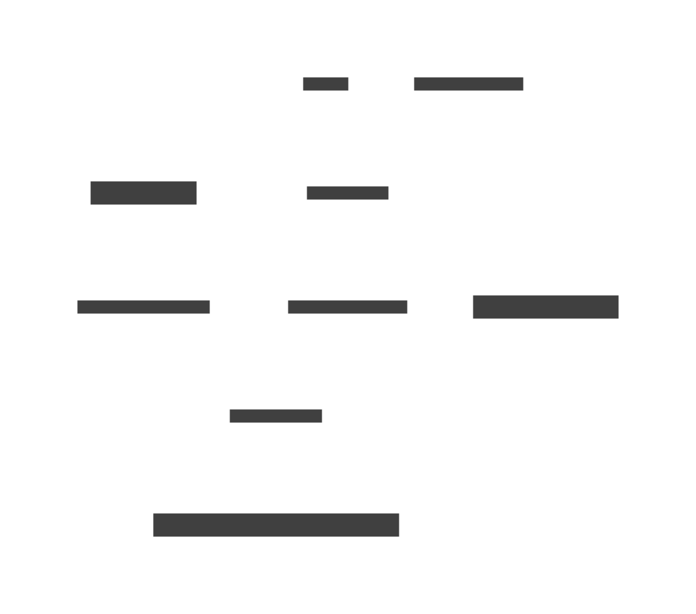

# Single-qubit systems

The concepts covered in this chapter are highlighted in the diagram below.

### Practitioner insights

* A single-qubit quantum system is like a coin: it has two possible measurement outcomes, and each of them has a probability with direction (amplitude) associated to it.
* The amplitudes change when single-qubit gates are applied to them by redistributing the two probabilities and arbitrarily changing their direction.
* An outcome can be thought of as a binary digit, 0 or 1. The number of qubits in a system defines the number of binary digits in its possible measurement outcomes.
* A qubit does not need to have a special representation in quantum computing, as it is already represented as a position in binary string outcomes.
* We visualize amplitudes as rows in a table, including their magnitude, direction, and a colored bar.

